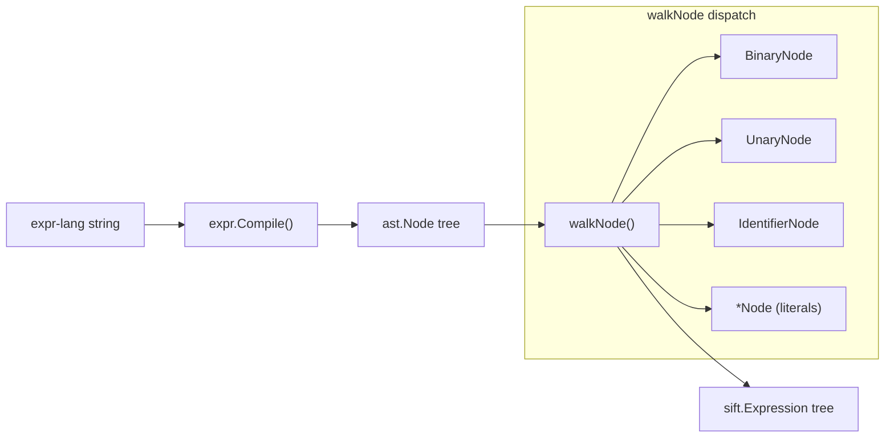

# Design Document: Expr-Lang to Sift Parser

## Overview

This feature adds the reverse direction to the `thru/exprlang` adapter package: parsing an expr-lang expression string into a `sift.Expression` AST. The existing adapter converts `sift.Expression → expr-lang string`; this parser adds `expr-lang string → sift.Expression`.

The parser leverages `expr.Compile()` from the `github.com/expr-lang/expr` library (v1.16.9) to parse the input string into an expr-lang AST, then walks that AST to produce sift nodes. This avoids writing a custom parser and guarantees syntactic correctness via the expr-lang compiler.

Two modes are supported:
- **Strict mode** (default): Unsupported expr-lang constructs produce descriptive errors.
- **Lenient mode** (opt-in via functional option): Unsupported constructs are wrapped as `exprlang.RawExpression` custom sift nodes.

A key design challenge is **between detection**: recognizing the pattern `field >= min and field <= max` (or `&&` variant) in the expr-lang AST and collapsing it into a single `sift.Condition` with `OperationBetween`.

## Architecture

The parser is a single-pass recursive AST walker. It receives the root `ast.Node` from `expr.Compile()` and produces a `sift.Expression` tree.



The data flow is:

1. **Input**: An expr-lang string (e.g. `status == "active" && age > 18`)
2. **Compile**: `expr.Compile(input)` produces a `*vm.Program` whose AST root is accessible via `program.Node()`
3. **Walk**: `walkNode(node, config)` dispatches on the concrete `ast.Node` type
4. **Output**: A `sift.Expression` tree (or error)

### Key Design Decisions

1. **Use expr.Compile() for parsing**: Rather than writing a custom lexer/parser, we delegate to expr-lang's own compiler. This guarantees we handle the same syntax expr-lang handles, including operator precedence and grouping. We use `expr.AllowUndefinedVariables()` so the compiler doesn't require a typed environment.

2. **Functional options for configuration**: The `Parse` function accepts `ParseOption` values following Go's idiomatic `func(*parserConfig)` pattern. This allows adding future options (e.g. custom function registry) without breaking the API.

3. **Between detection via pattern matching**: The expr-lang AST represents `age >= 18 and age <= 65` as a `BinaryNode` with `&&`/`and` operator, where both children are comparisons on the same field. The walker checks for this pattern before falling through to normal AND handling.

4. **Strict mode as default**: Since downstream backends (DynamoDB, SQL) cannot execute arbitrary expr-lang, the safe default rejects unsupported constructs. Lenient mode is opt-in for use cases where the downstream can handle raw expr-lang (e.g. in-memory evaluation).

## Components and Interfaces

### New File: `thru/exprlang/parser.go`

This is the only new file needed. It contains:

#### Public API

```go
// ParseOption configures the parser behavior.
type ParseOption func(*parserConfig)

// WithLenientMode enables lenient parsing where unsupported expr-lang
// constructs are wrapped as exprlang.RawExpression custom sift nodes
// instead of returning errors.
func WithLenientMode() ParseOption

// Parse parses an expr-lang expression string into a sift.Expression AST.
// It uses expr.Compile() to parse the string into an expr-lang AST, then
// walks the AST to produce sift nodes.
//
// By default, the parser operates in strict mode where unsupported
// expr-lang constructs return descriptive errors. Use WithLenientMode()
// to wrap unsupported constructs as RawExpression nodes instead.
func Parse(input string, opts ...ParseOption) (sift.Expression, error)
```

#### Internal Types

```go
// parserConfig holds configuration for the parser.
type parserConfig struct {
    lenient bool // when true, wrap unsupported constructs as RawExpression
}

// walker holds the parser configuration and walks the expr-lang AST.
type walker struct {
    cfg    *parserConfig
    source string // original input string, used for RawExpression extraction
}
```

#### Core Walk Function

```go
// walkNode dispatches on the concrete ast.Node type and returns a sift.Expression.
func (w *walker) walkNode(node ast.Node) (sift.Expression, error)
```

The dispatch logic:

| expr-lang AST Node | Sift Output | Notes |
|---|---|---|
| `*ast.BinaryNode` with `==`, `!=`, `<`, `<=`, `>`, `>=` | `*sift.Condition` | Comparison operators |
| `*ast.BinaryNode` with `&&` / `and` | `*sift.AndOperation` or `*sift.Condition{OperationBetween}` | Check between pattern first |
| `*ast.BinaryNode` with `\|\|` / `or` | `*sift.OrOperation` | |
| `*ast.BinaryNode` with `contains` | `*sift.Condition{OperationContains}` | String operator |
| `*ast.BinaryNode` with `startsWith` | `*sift.Condition{OperationBeginsWith}` | String operator |
| `*ast.BinaryNode` with `in` | `*sift.Condition{OperationIn}` | Membership; note operand order is reversed |
| `*ast.BinaryNode` with `endsWith`, `matches` | Error (strict) or RawExpression (lenient) | Unsupported string ops |
| `*ast.UnaryNode` with `!` / `not` | `*sift.NotOperation` | |
| `*ast.BinaryNode` with `==` and nil right-hand side | `*sift.Condition{OperationNotExists}` | `field == nil` |
| `*ast.BinaryNode` with `!=` and nil right-hand side | `*sift.Condition{OperationExists}` | `field != nil` |
| Any other node type | Error (strict) or RawExpression (lenient) | Function calls, arithmetic, ternary, etc. |

### Between Detection

The between pattern matcher examines `BinaryNode` nodes with `&&`/`and` operator:

```go
// tryBetween checks if a BinaryNode represents a between pattern:
//   field >= min && field <= max  (or with 'and' keyword)
// Returns (sift.Expression, true) if matched, (nil, false) otherwise.
func (w *walker) tryBetween(node *ast.BinaryNode) (*sift.Condition, bool)
```

The algorithm:
1. Check that the operator is `&&` or `and`
2. Check that both left and right children are `*ast.BinaryNode`
3. Check that one side uses `>=` and the other uses `<=`
4. Extract the field name (identifier) from both sides
5. Verify both sides reference the same field
6. Extract the min and max literal values
7. Return a `sift.Condition{Operation: OperationBetween, Value: "min,max"}`

### Value Extraction

```go
// extractValue converts an expr-lang literal node to its string representation
// suitable for sift.Condition.Value.
func extractValue(node ast.Node) (string, bool)
```

| Node Type | Output |
|---|---|
| `*ast.StringNode` | The unquoted string value |
| `*ast.IntegerNode` | `strconv.Itoa(node.Value)` |
| `*ast.FloatNode` | `strconv.FormatFloat(node.Value, 'f', -1, 64)` |
| `*ast.BoolNode` | `"true"` or `"false"` |
| `*ast.NilNode` | Special handling (used for exists/not-exists detection) |

### Field Name Extraction

```go
// extractFieldName extracts the field name from an identifier or member node.
func extractFieldName(node ast.Node) (string, bool)
```

Handles `*ast.IdentifierNode` (simple field names like `status`) and `*ast.MemberNode` (dotted paths like `Author.Name`, though dotted paths may be treated as unsupported depending on sift's capabilities).

### Unsupported Construct Handling

```go
// handleUnsupported either returns an error (strict mode) or wraps the
// node as a RawExpression (lenient mode).
func (w *walker) handleUnsupported(node ast.Node, reason string) (sift.Expression, error)
```

In lenient mode, the function uses the node's source position information to extract the original sub-expression text from `w.source` and wraps it as `exprlang.RawExpression`. In strict mode, it returns a descriptive error including the construct type and reason.

### Existing File Changes

**`thru/exprlang/custom.go`**: No changes needed. The existing `RawExpression()`, `NewCustomExpression()`, and `CustomExpression` type are reused as-is for lenient mode wrapping.

**`thru/exprlang/adapter.go`**: No changes needed. The existing `Adapter` (formatter direction) is unchanged.

**`thru/exprlang/README.md`**: Updated to document the new `Parse` function, strict/lenient modes, and future custom function registry possibility.

## Data Models

### Parser Configuration

```go
type parserConfig struct {
    lenient bool
}
```

Minimal configuration. The functional options pattern allows future extension (e.g. `WithCustomFunctionRegistry()`) without breaking changes.

### AST Node Mapping

The parser maps expr-lang AST nodes to existing sift types. No new sift types are introduced.

| Input (expr-lang) | Output (sift) |
|---|---|
| `status == "active"` | `&sift.Condition{Name: "status", Operation: sift.OperationEQ, Value: "active"}` |
| `age >= 18 and age <= 65` | `&sift.Condition{Name: "age", Operation: sift.OperationBetween, Value: "18,65"}` |
| `"admin" in roles` | `&sift.Condition{Name: "roles", Operation: sift.OperationIn, Value: "admin"}` |
| `field != nil` | `&sift.Condition{Name: "field", Operation: sift.OperationExists}` |
| `field == nil` | `&sift.Condition{Name: "field", Operation: sift.OperationNotExists}` |
| `a && b` | `&sift.AndOperation{Left: a', Right: b'}` |
| `a \|\| b` | `&sift.OrOperation{Left: a', Right: b'}` |
| `!a` | `&sift.NotOperation{Child: a'}` |
| `name contains "foo"` | `&sift.Condition{Name: "name", Operation: sift.OperationContains, Value: "foo"}` |
| `name startsWith "bar"` | `&sift.Condition{Name: "name", Operation: sift.OperationBeginsWith, Value: "bar"}` |
| `len(items) > 5` (lenient) | `exprlang.RawExpression("len(items) > 5")` wrapped as sift custom node |

## Correctness Properties

*A property is a characteristic or behavior that should hold true across all valid executions of a system — essentially, a formal statement about what the system should do. Properties serve as the bridge between human-readable specifications and machine-verifiable correctness guarantees.*

### Property 1: Format-then-parse round trip

*For any* valid `sift.Expression` tree composed only of supported operations (`Condition` with all comparison/string/membership/existence/between operations, `AndOperation`, `OrOperation`, `NotOperation`), formatting it to an expr-lang string via the existing `Adapter` and then parsing it back via the new `Parse` function shall produce a semantically equivalent `sift.Expression` tree.

**Validates: Requirements 1.1, 1.2, 1.3, 1.4, 1.5, 1.6, 1.7, 1.8, 1.9, 2.1, 2.3, 2.5, 2.7, 2.8, 3.1, 3.2, 4.1, 4.2, 4.3, 6.1, 6.2, 8.1**

### Property 2: Parse-then-format evaluation equivalence

*For any* valid `sift.Expression` tree composed only of supported operations, formatting to an expr-lang string, parsing back, and formatting again shall produce an expr-lang string that, when compiled and evaluated by expr-lang against any input data, yields the same boolean result as the original expr-lang string.

**Validates: Requirements 8.2**

### Property 3: Strict mode rejects unsupported constructs

*For any* expr-lang string that contains at least one unsupported construct (function calls, array predicates, arithmetic, ternary, pipe operators, `endsWith`, `matches`), parsing in strict mode (the default) shall return a non-nil error whose message contains a description of the unsupported construct type.

**Validates: Requirements 5.1, 5.2, 5.3, 5.4, 5.5, 5.6, 5.7, 9.6**

### Property 4: Lenient mode wraps unsupported constructs

*For any* expr-lang string that contains unsupported constructs (possibly mixed with supported constructs), parsing in lenient mode shall return a non-nil `sift.Expression` without error, where unsupported sub-expressions are wrapped as `exprlang.RawExpression` custom nodes and supported sub-expressions are correctly parsed into their corresponding sift node types.

**Validates: Requirements 9.1, 9.2, 9.3, 9.4**

## Error Handling

### Compile Errors

When `expr.Compile()` fails (syntactically invalid input), the parser returns the expr-lang compiler error directly. This provides position information and descriptive messages from the expr-lang library.

### Empty Input

When the input string is empty or whitespace-only, the parser returns a descriptive error before calling `expr.Compile()`.

### Unsupported Construct Errors (Strict Mode)

Each unsupported construct produces an error of the form:

```
exprlang: unsupported construct: <type> (<details>)
```

Examples:
- `exprlang: unsupported construct: function call (len)`
- `exprlang: unsupported construct: arithmetic operator (*)`
- `exprlang: unsupported construct: string operator (endsWith) has no sift equivalent`
- `exprlang: unsupported construct: conditional expression`

### Between Pattern Mismatch

When an AND node has two comparisons on the same field but with operators other than `>=`/`<=` (e.g. `field > min and field < max`), the parser does NOT collapse to between. It produces a normal `AndOperation` with two `Condition` children. This is correct behavior — only the `>=`/`<=` pattern maps to sift's `OperationBetween` which is inclusive on both bounds.

### Value Extraction Failures

If a comparison node has a non-literal value (e.g. a function call result), the parser treats the entire comparison as unsupported and handles it according to the current mode (error in strict, RawExpression in lenient).

## Testing Strategy

### Property-Based Testing

The parser uses **property-based testing** with the `github.com/leanovate/gopter` library (or `pgregory.net/rapid` — whichever is already in use or most idiomatic for the project). Each correctness property from the design is implemented as a single property-based test with a minimum of 100 iterations.

Each property test is tagged with a comment referencing the design property:
```go
// Feature: exprlang-to-sift-parser, Property 1: Format-then-parse round trip
```

**Generators needed:**
- Random `sift.Expression` trees (bounded depth, using only supported operations)
- Random field names (valid Go identifiers)
- Random values (strings, integers, floats, booleans)
- Random unsupported expr-lang strings (function calls, arithmetic, etc.)

### Unit Tests

Unit tests complement property tests by covering:

- **Specific examples**: Each supported operator with concrete values
- **Edge cases**: Empty input, whitespace-only input, deeply nested expressions, between pattern with `and` vs `&&`
- **Error conditions**: Invalid syntax, unsupported constructs in strict mode with error message verification
- **Lenient mode examples**: Specific unsupported constructs wrapped as RawExpression
- **Mixed mode examples**: Expressions mixing supported and unsupported constructs in lenient mode

### Test Organization

Tests live in `thru/exprlang/parser_test.go` with:
- Table-driven unit tests for each operator mapping
- Property-based tests for round-trip and mode behavior
- Integration tests verifying the full pipeline (parse → sift.Thru → backend adapter)
